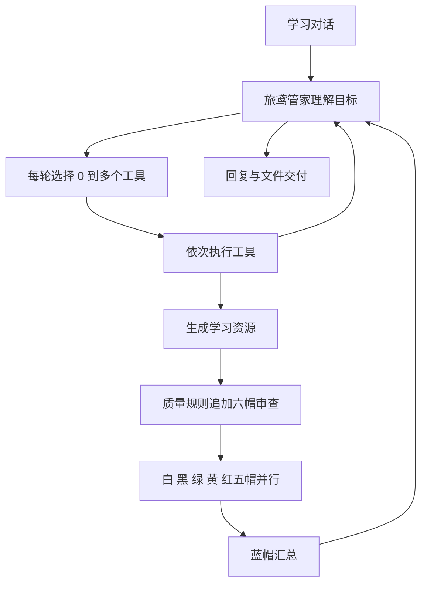
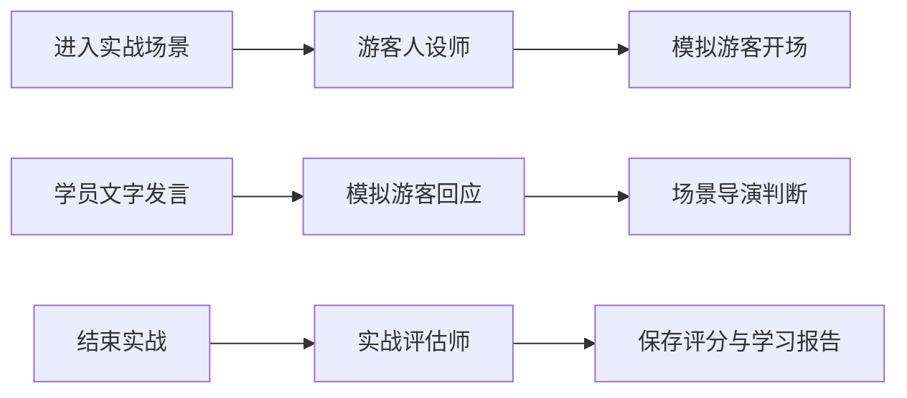

# 旅鸢：多智能体协作与学习流程

本次盘点以共享后端的实例、工具处理函数和实际调用位置为依据。界面沿用旅鸢名称、现有 Logo、蓝白底色与山水细节；学习路线页面的原有布局和配色保留。

## 角色数量与执行边界

当前协作清单含 **17 个可执行角色**：13 个学习角色、4 个实战角色。其中 15 个有独立类实例；模拟游客和实战评估师在 `SandboxService` 内直接调用模型，作为两个执行角色展示。

| 分组 | 角色 ID | 职责 |
| --- | --- | --- |
| 调度 | concierge | 理解目标、选择工具、组织最终回复 |
| 学习 | profile | 维护学员画像 |
| 学习 | retrieval | 检索知识库、参考依据 |
| 学习 | text_generator | 生成讲义和训练材料 |
| 学习 | training_analyzer | 题库抽题、判分、学情分析 |
| 学习 | essay_question | 生成简答题与评分要点 |
| 学习 | learning_planner | 制定学习计划 |
| 六帽 | white_hat | 事实与证据 |
| 六帽 | black_hat | 漏洞与风险 |
| 六帽 | green_hat | 创意与改进 |
| 六帽 | yellow_hat | 价值与可行性 |
| 六帽 | red_hat | 学员与主题适配 |
| 六帽 | blue_hat | 汇总五帽意见、判断修订需求 |
| 实战 | customer_generator | 生成游客人设 |
| 实战 | customer_simulator | 游客对话、情绪与记忆 |
| 实战 | scene_director | 判断阶段推进、成功与失败 |
| 实战 | sandbox_evaluator | 五维评分、复盘建议 |

`AgentId` 含 18 个枚举项。`chart_generator`、`html_demo_generator`、`image_generator` 共 3 个为预留，当前没有接入工具处理或类实例，界面明确注明尚未启用。会话摘要、记忆、网络检索、掌握度计算等属于支持服务，不计为独立协作 Agent。

抽选择题复用 `TrainingService` 的程序抽题与判分。界面将它归在测评分析师下，不能据此推断每次抽题都调用了模型。

## 真实调用链

一般工具在一轮内串行执行；五帽通过最多 5 个工作线程并行执行，蓝帽等待五帽全部完成后汇总。管家根据工具结果继续决定下一轮，当前编排循环上限为 8 轮。审查未通过可能触发修订和再次审查，角色清单与次数以事件为准。

资源生成后的自动六帽审查，以及纠错收口后的自动抽题，是已有程序规则。追加分工事件带 `source: policy`，界面显示“流程规则追加分工”，与模型选择的分工分开说明。

实战链由 `SandboxService` 的固定流程调度，场景导演负责推进判断。实时语音使用独立语音连接；已有台词落库行为不会额外制造游客或导演的调用事件。

## 事件、状态与动画

- `GET /agents/catalog` 返回实际角色清单与预留项。
- 对话沿用 `POST /messages`；实战新增异步开始、发言、结束接口，统一通过 `GET /tasks/{task_id}` 轮询。
- 每条轨迹包含角色、公开动作说明、状态、时间、递增序号；分工事件还包含本轮角色列表、工具与轮次。
- 固定展示四段进度：理解目标、确定分工、协作执行、汇总交付。待安排阶段为灰色，执行阶段为蓝色，完成阶段为绿色；异常及降级用提示色，跳过的步骤注明本次无需。仅实际执行中的角色转圈。
- 默认展示本次参与的角色，优先排列正在执行的角色。其余待命角色与每轮分工记录收纳在协作详情中，任务结束或中断后停止执行动画。
- 工作角色数量从最近的真实执行事件计算。分工完成即结束管家的该轮判断，等待工具返回时不会继续计入工作数量。
- 五帽开始事件一组出现，保留并行关系。通常按约 220 毫秒呈现相邻事件，积压较多时缩短至 70 毫秒；接口结果到达后立即交付回复，剩余事件明确标注“回看调用过程”。动画不增加模型执行耗时。
- 切换账户、过期任务、状态请求乱序均有隔离。支持减少动态效果的系统偏好；悬浮窗可收起，并从顶部重新展开。

## 首页、全局流程与学习推荐

顶部使用三个紧凑一级栏目：**学前测试、专项练习、综合实战**。每个栏目下方展示二级导航：

| 一级栏目 | 二级功能 |
| --- | --- |
| 学前测试 | 自我画像、知识摸底、学习建议 |
| 专项练习 | 做题练习、沟通训练、应急处理 |
| 综合实战 | 行前定制、行中接待、行后复盘 |

学习资源、学习路线、工具箱放在顶栏右侧，以带图标的按钮组展示。学前测试的三个页面分别突出学习名片、知识测验和下一步建议；画像卡左侧保留建立画像按钮。做题页面将随机抽题、按知识点练习、错题巩固、阶段测验放在学习对话卡上方。

场景照片由任务 UI 替代。沟通训练采用双列任务卡，应急处理采用横向任务卡，综合实战采用阶段介绍、分项练习与全流程任务的层次结构。综合实战按现有模板分组，16 个场景均可通过三项二级菜单找到，跨文化全程场景归入行中接待，前置练习解锁规则保留。

页面沿用蓝白背景，浅蓝和白底上的正文、辅助说明与标签采用深蓝或深灰色，链接使用独立深蓝文字色。边框、背景和国风装饰维持低强度，文字层级由字号和粗细区分。学习路线仍使用原有独立视觉样式。

游客可浏览首页、学前说明与训练场景，点击登录或开始训练后进入注册与全屏分栏画像流程。个人资源和学情页继续校验账户。切换同一页面的功能不重建页面实例，跨页面采用缓存保留学习草稿，切换账户后清空页面缓存。标签与页面使用短时透明度和位移动画，减少动态效果偏好会关闭动画。

二级导航右侧用紧凑状态区显示当前学习、答题、实战阶段及协作入口。`GET /learning/status` 读取持久化教学状态、掌握度、作答和实战记录，按规则推荐下一步：

1. 有待纠错题或连续答错：优先复习错因。
2. 当前主题完成或平均掌握度达到 80%：推荐综合实战。
3. 已进入答题阶段：继续测验。
4. 其余情况：先学习再作答巩固。

推荐保留现有管家教学与纠错状态机，实战前置课程解锁规则继续生效。无需增加额外模型调用。专项和综合完成次数分别统计；进度完成标记仅根据已有证据显示。

## 答题、沟通与资源

真实题目就绪后打开全屏答题界面。选择题与简答题通过原对话接口提交，沿用既有判分、纠错、难度调整机制；反馈与新题采用淡入和位移动画。支持键盘焦点约束及退出回到学习对话。

新增电话接待和微信需求访谈两个场景，均含三个阶段，复用游客、导演、评估链。应急入口仅展示应急处置类别；已有文化礼仪和接待场景放入沟通接待分组，即兴讲解保留独立入口。

学习资源留在定制学习资源页面：增加类型数量概览、模块卡片和计划时间线。模块与要点按原文标题、列表顺序提取，代码围栏中的标题不会混入目录；完整原文和导出功能保留。

## 验证与本机更新

前端执行 `npm --prefix sinanlike/frontend run build`，状态逻辑检查使用 `node sinanlike/frontend/scripts/check-cooperation.cjs`。导航检查使用 `node sinanlike/frontend/scripts/check-navigation.cjs`，注册画像流程检查使用 `node sinanlike/frontend/scripts/check-registration.cjs`。这些检查覆盖角色状态、真实布局、路由守卫、页面缓存及注册画像流程。

本轮已在本地浏览器核对三个学前页面、做题、沟通、应急及三个综合实战阶段，并验证桌面和手机尺寸。浅色背景上的可见文字进行颜色与对比度检查；协作窗口使用明确标注的验证示例检查执行、完成、中断与收起状态。

后端使用模型替身和隔离数据库验证编排、任务执行器、实战服务与 API，新增测试覆盖动态分工、五帽并行、管家直接回复、异步沟通及状态推荐。

本机桌面前端在构建后通过部署脚本更新，先保留旧编译页面备份，再替换新页面，并核对构建与部署文件一致。账户数据库、环境配置与历史记录保留。后端源码更新后需要重启对应服务以加载新的路由和事件。本机程序、编译产物、数据库与部署备份不提交到共享仓库。
